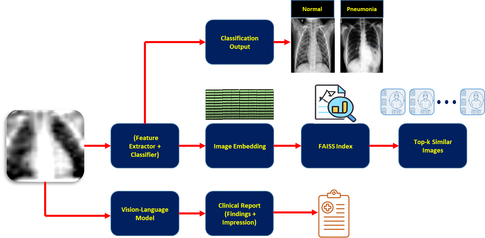
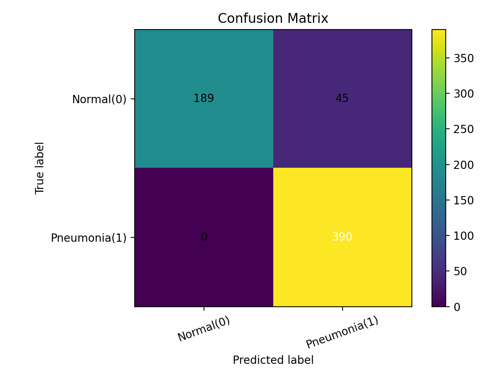
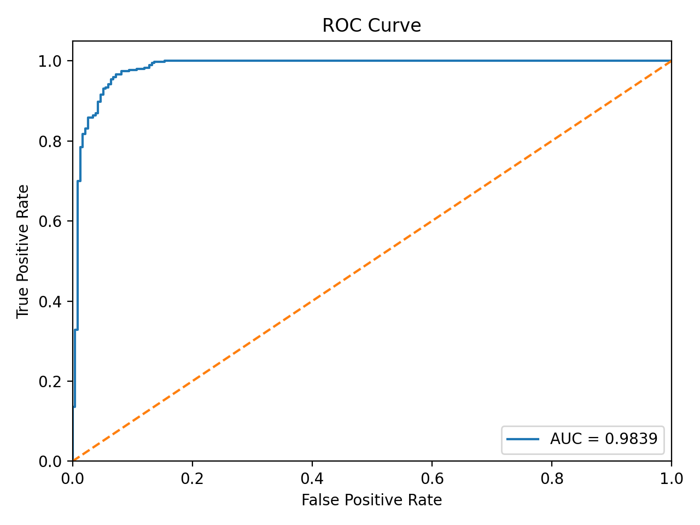
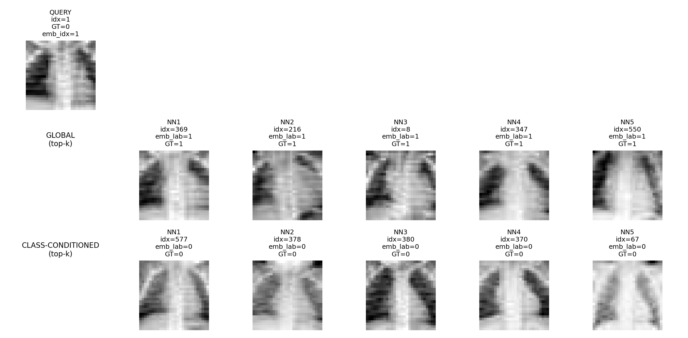
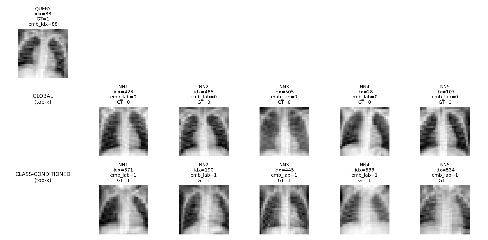
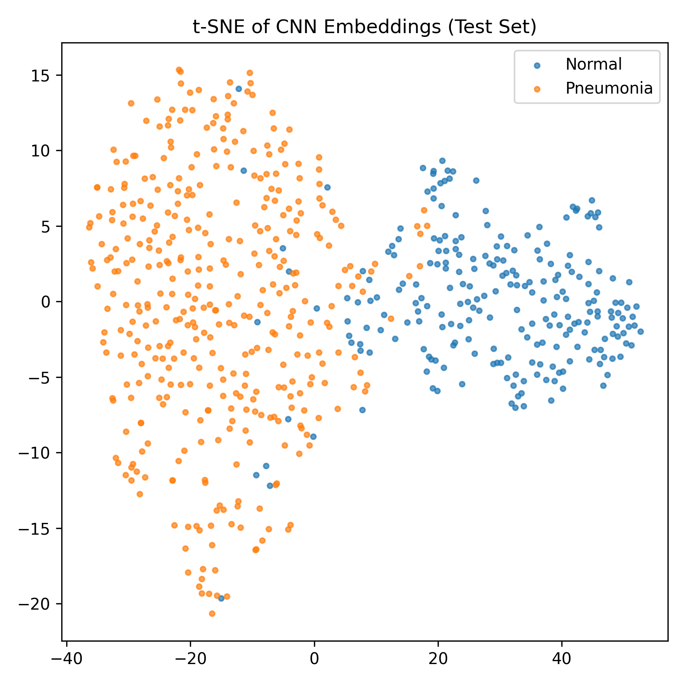
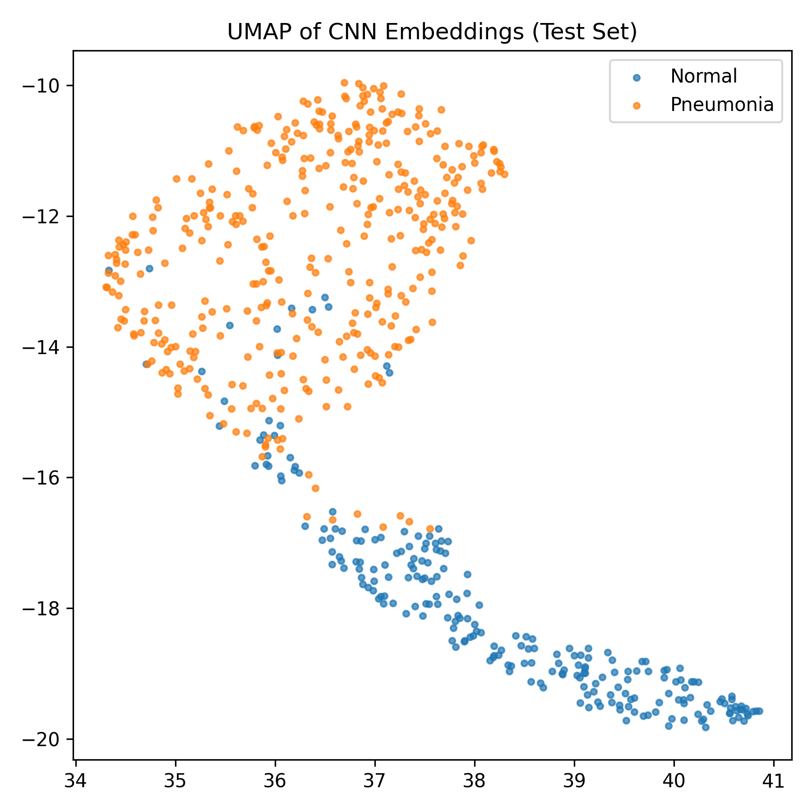

# PDCP – End-to-End Medical AI Pipeline  
## PneumoniaMNIST: Classification, Reasoning, and Semantic Retrieval

---
## Table of Contents

- [Overview](#overview)
- [Dataset](#dataset)
- [Task 1 – CNN Classification](#task-1--cnn-classification)
- [Task 2 – Vision-Language Model](#task-2--vision-language-model-vlm-report-generation)
- [Task 3 – Semantic Image Retrieval](#task-3--semantic-image-retrieval-cnn-embeddings--faiss)
- [Installation](#installation)
- [Experimental Limitations](#experimental-limitations)
- [License](#license)
---

## Overview

This repository presents a complete **end-to-end medical AI pipeline** built on the PneumoniaMNIST dataset. The project demonstrates three core AI capabilities integrated into a single workflow:

1. **CNN-based medical image classification**
2. **Vision-Language Model (VLM) clinical report generation**
3. **Semantic image retrieval using CNN embeddings with FAISS**



The system is designed to simulate a simplified clinical reasoning pipeline:

> Perception → Explanation → Case-Based Memory

All experiments and evaluations are also implemented in: `PDCP_End_to_End_Demo.ipynb`


---

## Dataset

- **Dataset:** PneumoniaMNIST (MedMNIST v2)
- **Modality:** Chest X-ray
- **Classes:**
  - `0 = Normal`
  - `1 = Pneumonia`
- **Resolution:** 28 × 28 grayscale
- **Test Images:** 624

Due to the low spatial resolution, fine-grained radiological structures are limited. The dataset primarily captures coarse structural patterns.

---

# Task 1 – CNN Classification

## Objective

Train and evaluate a Convolutional Neural Network (CNN) to classify chest X-rays as:

- Normal
- Pneumonia

## Pipeline

Input Image → CNN → Softmax → Predicted Label


## Outputs

- Predicted class
- Probability score
- Evaluation metrics

## Evaluation Metrics

- Accuracy
- Precision
- Recall
- F1-score

The CNN acts as the **perception layer**, extracting visual patterns and mapping them to diagnostic categories.

<p align="center">
  
  
</p>


---

# Task 2 – Vision-Language Model (VLM) Report Generation

## Objective

Generate a structured radiology-style report from a chest X-ray using a quantized Vision-Language Model.

## Key Characteristics

- 4-bit quantized model (memory efficient)
- Structured report output
- Robust fallback mechanism
- CNN vs VLM disagreement analysis

## Pipeline

Input Chest X-ray → Vision-Language Model → Clinical Report


## Example Output Structure

- Findings
- Impression
- Confidence reasoning

## Purpose

This stage provides:

- Model interpretability
- Human-readable explanation
- Reasoning layer over CNN predictions

The VLM serves as the **explanation and reasoning component** of the system.

[View Detailed generated reports](reports/task2/generated_reports.md)

[View Detailed CNN vs VLM Comparison](reports/task2/cnn_vlm_comparison.md)

---

# Task 3 – Semantic Image Retrieval (CNN Embeddings + FAISS)

## Objective

Retrieve semantically and visually similar chest X-ray images given a query image.

## Architecture

Image → CNN → Feature Embedding → FAISS Index → Top-k Retrieval


## Procedure

1. Extract feature embeddings using the CNN backbone
2. Build a FAISS similarity index
3. Query nearest neighbors
4. Evaluate using Precision@k

## Evaluation Metric

**Precision@k** measures the proportion of retrieved images (within top-k) that share the same label as the query.







---

# System Design Philosophy

The pipeline mirrors human clinical workflow:

| Level | Function | Component |
|--------|-----------|------------|
| 1 | Perception | CNN |
| 2 | Explanation | Vision-Language Model |
| 3 | Memory | FAISS Retrieval |

This layered structure demonstrates how perception, reasoning, and similarity-based memory can be integrated into a unified AI system.

---

# Installation

## Requirements

- Python ≥ 3.10
- PyTorch
- torchvision
- faiss-cpu
- transformers
- bitsandbytes
- medmnist
- numpy
- matplotlib
- scikit-learn

## Install Dependencies

```bash
pip install torch torchvision faiss-cpu transformers bitsandbytes medmnist numpy matplotlib scikit-learn
```

## Running the Notebook

Launch Jupyter:

jupyter notebook PDCP_End_to_End_Demo.ipynb

Run all cells sequentially from top to bottom.

---

## Experimental Limitations

- Low-resolution images (28×28)
- Binary classification only
- Limited dataset size
- No external validation dataset
- Embeddings not contrastively trained

---

## Potential Extensions

- Add ROC curve and AUC analysis
- Include Recall@k, mAP, or nDCG for retrieval
- Visualize embedding space using t-SNE or UMAP
- Fine-tune embeddings using contrastive learning
- Perform VLM hallucination analysis
- Add statistical confidence intervals

---

## Research Applications

This framework can serve as a foundation for:

- Clinical decision support systems
- AI-assisted radiology tools
- Case-based medical retrieval systems
- Digital twin similarity modeling
- Multimodal medical AI research

---

## Reproducibility

The entire pipeline is contained within a single notebook for transparency and reproducibility.

For consistent results:

- Fix random seeds
- Use deterministic FAISS configuration
- Pin library versions

---

## License

For academic and research use.


